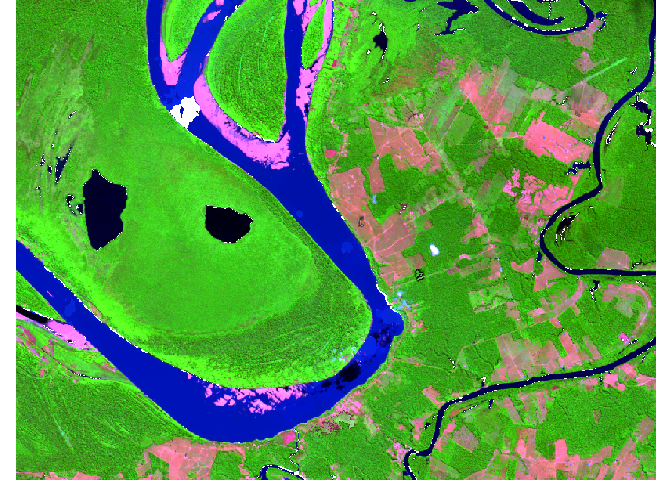
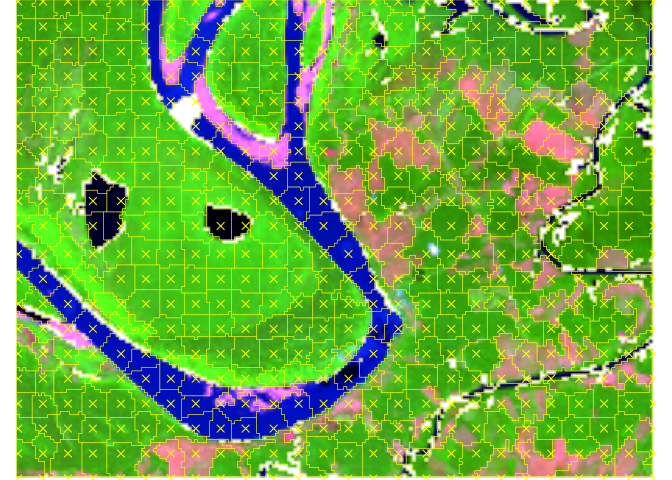
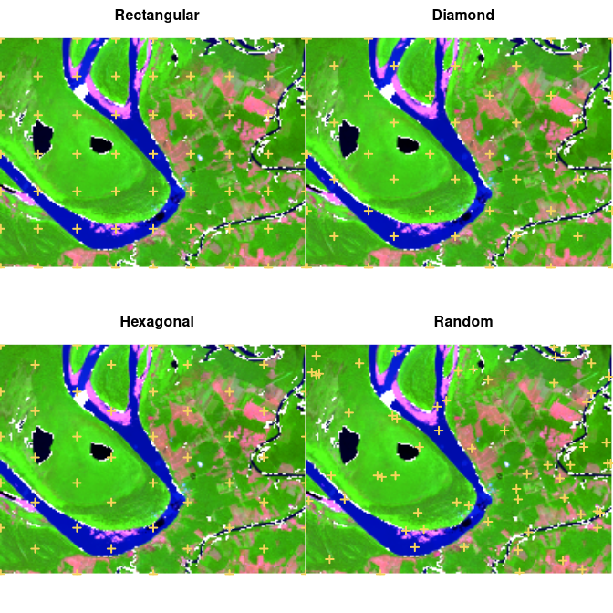
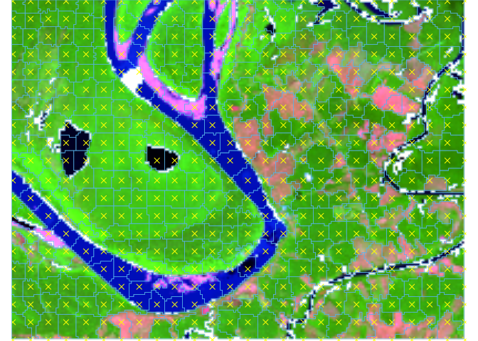
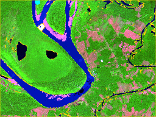

# snic <a id="top"></a>

<!-- badges: start -->

[](https://github.com/rolfsimoes/snic/actions/workflows/R-CMD-check.yaml)
<!-- badges: end -->

Efficient superpixel segmentation for multi-band imagery using the
Simple Non-Iterative Clustering (SNIC) algorithm. The package wraps a
C++ implementation with an ergonomic R interface, integrates with
`terra` for raster workflows, and provides helpers for seed placement,
plotting, and reproducibility.

## Installation

``` r
# install.packages("pak")
pak::pak("rolfsimoes/snic")

# alternatively with remotes
# remotes::install_github("rolfsimoes/snic")
```

The `terra` package is suggested for raster support and required for
most of the plotting utilities demonstrated below.

## Highlights

- Implements SNIC with a fast C++ core exposed to R
- Works with in-memory arrays or `terra::SpatRaster` objects
- Offers multiple seeding strategies (`snic_grid_rect()`,
  `snic_grid_diamond()`, `snic_grid_hexagon()`, `snic_grid_random()`) and
  interactive placement via `snic_grid_manual()`
- Includes ready-to-plot utilities (`snic_plot()`) for quick inspection
  of inputs, seeds, and resulting segments
- Ships with a Sentinel-2 subset
  (`system.file("S2-20LMR", package = "snic")`) for reproducible
  examples and tests

## Pipeline overview

The SNIC workflow is short and reproducible:

- **Step 1 – Seed placement.** Select or draw a grid of starting seeds
  that guide where the superpixels will grow. Grids can be generated
  automatically (`snic_*_grid()`) or crafted interactively with
  `snic_grid_manual()`.
- **Step 2 – Segmentation.** Run `snic()` with the chosen seeds to grow
  superpixels and inspect the result with `snic_plot()` or the animated
  helper `snic_animation()`.

## Quick start

The example below demonstrates a typical SNIC workflow with the bundled
Sentinel-2 subset.

``` r
load_snic <- function() {
  if (requireNamespace("pkgload", quietly = TRUE) && file.exists("DESCRIPTION")) {
    pkg_name <- tryCatch(
      read.dcf("DESCRIPTION", fields = "Package"),
      error = function(e) NULL
    )
    if (!is.null(pkg_name) && identical(pkg_name[[1]], "snic")) {
      return(pkgload::load_all(export_all = FALSE, helpers = FALSE, attach_testthat = FALSE))
    }
  }

  if (requireNamespace("snic", quietly = TRUE)) {
    exports <- tryCatch(
      getNamespaceExports("snic"),
      error = function(e) character()
    )
    required_exports <- c("snic_grid_rect", "snic_grid_diamond", "snic_grid_hexagon", "snic_grid_random")
    if (all(required_exports %in% exports)) {
      return(library(snic))
    }
  }

  if (requireNamespace("pkgload", quietly = TRUE)) {
    return(pkgload::load_all(export_all = FALSE, helpers = FALSE, attach_testthat = FALSE))
  }

  stop("Install the development version (via pkgload) or the released snic package to run this example.", call. = FALSE)
}

load_snic()
#> ℹ Loading snic

library(terra)
#> terra 1.8.70

# Sentinel-2 subset packaged with snic
data_dir <- system.file("S2-20LMR", package = "snic", mustWork = TRUE)
bands <- c("B02", "B04", "B08", "B12")
paths <- file.path(
  data_dir,
  sprintf("S2_20LMR_%s_20220630.tif", bands)
)

s2 <- terra::rast(paths)

# Aggregate raster to speed up the example
s2_small <- terra::aggregate(s2, fact = 5)

# Seed generation and segmentation
spacing <- 8L
seeds <- snic_grid_rect(s2_small, spacing = spacing, padding = 0L)
segments <- snic(s2_small, seeds = seeds, compactness = 0.1)

# Store for later sections
s2_demo <- s2_small
seeds_rect <- seeds
segments_rect <- segments

# Visualise RGB composite with superpixel boundaries
snic_plot(
  s2_small,
  r = 4, g = 3, b = 1,
  stretch = "lin",
  seg = segments,
  seg_plot_args = list(border = "#FFFF00", col = NA, lwd = 0.6)
)
```

<!-- -->

For quick inspections from the console you can also rely on
`snic_plot()`:

``` r
snic_plot(
  s2_small,
  r = 4, g = 3, b = 1,
  seeds = seeds,
  seg = segments
)
```

<!-- -->

## Step 1 – Seed placement

Seed placement controls the number, shape, and location of the resulting
superpixels. The package ships with several grid generators, each
returning a two-column (`r`, `c`) matrix ready for `snic()`:

- `snic_grid_rect()` – equally spaced seeds along rows and columns.
- `snic_grid_diamond()` – staggered rows produce a diagonal pattern that
  better respects gradients.
- `snic_grid_hexagon()` – hexagonal tiling for more isotropic superpixels.
- `snic_grid_random()` – jittered seeds when structure is irregular or
  prior knowledge is limited.

Use `snic_count_seeds()` to forecast how many superpixels a spacing will
produce before running the algorithm.

``` r
set.seed(42)
spacing_demo <- 25L

seed_examples <- list(
  "Rectangular" = snic_grid_rect(s2_demo, spacing = spacing_demo, padding = 0L),
  "Diamond" = snic_grid_diamond(s2_demo, spacing = spacing_demo, padding = 0L),
  "Hexagonal" = snic_grid_hexagon(s2_demo, spacing = spacing_demo, padding = 0L),
  "Random" = snic_grid_random(s2_demo, spacing = spacing_demo, padding = 0L)
)

op <- par(mfrow = c(2, 2), mar = c(1.5, 1.5, 2, 1))

for (name in names(seed_examples)) {
  snic_plot(
    s2_demo,
    r = 4, g = 3, b = 1,
    stretch = "lin",
    seeds = seed_examples[[name]],
    seg_plot_args = NULL,
    seeds_plot_args = list(pch = 3, col = "#F6D55C", lwd = 2)
  )
  title(name)
}
```

<figure>

<figcaption aria-hidden="true">Seed placement strategies on the
Sentinel-2 example (spacing = 25).</figcaption>
</figure>

``` r

snic_count_seeds(s2_demo, spacing = spacing_demo)
#> [1] 48

par(op)
```

### Interactive placement

Automatic grids get you started quickly, but experts can refine seeds
interactively. `snic_grid_manual()` opens a plotting device where you
can add, move, or remove seeds on-the-fly and then feed the result
straight into `snic()`:

``` r
manual_seeds <- snic_grid_manual(
  s2_demo,
  base_seeds = seeds_rect,
  r = 4, g = 3, b = 1,
  stretch = "lin"
)

segments_manual <- snic(
  s2_demo,
  seeds = manual_seeds,
  compactness = 0.1
)
```

## Step 2 – SNIC segmentation

Once seeds are defined, pass them to `snic()` together with the imagery
and a `compactness` factor. The result is a labeled raster that can be
visualized alongside the seeds for validation.

``` r
snic_plot(
  s2_demo,
  r = 4, g = 3, b = 1,
  stretch = "lin",
  seeds = seeds_rect,
  seg = segments_rect,
  seg_plot_args = list(border = "#56B4E9", col = NA, lwd = 0.6)
)
```

<!-- -->

## Animated seeding review

`snic_animation()` replays the seeding process, adding one seed per
frame, re-running `snic()`, and composing the frames into a GIF. Cache
the chunk so the animation is generated only once.

<figure>

<figcaption aria-hidden="true">Sequential SNIC segmentation as seeds are
added (random grid, 20 frames).</figcaption>
</figure>

## Contributing

Bug reports, feature requests, and pull requests are welcome in the
[issue tracker](https://github.com/rolfsimoes/snic/issues). When
proposing changes, please run `R CMD check` locally to ensure the
package remains stable.
